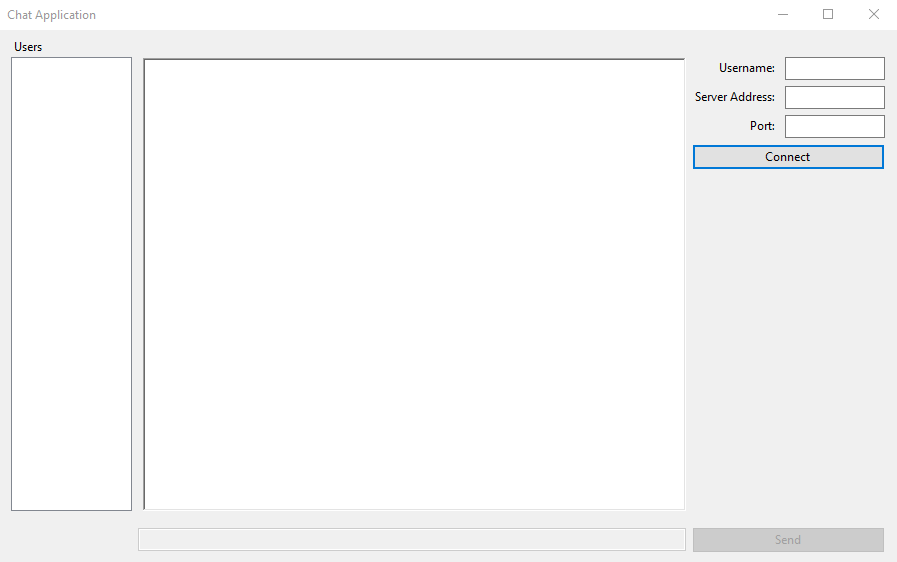
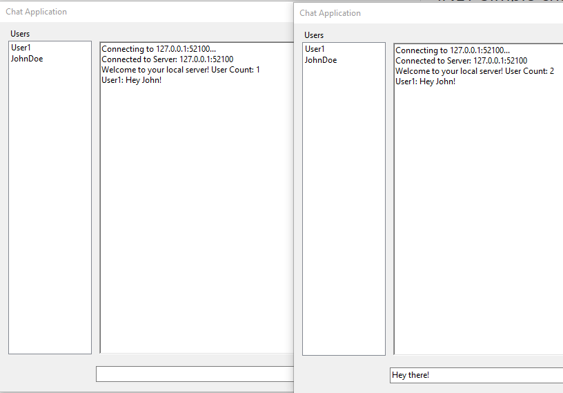

# Windows Form Chat Application
> Chat Application utilizing WPF and .NET 6.0
 
 Using `Sockets` and `TCPListener/Client`, Created a simple chat application that allows for user text input with custom username and updated user list side panel.

Server runs from a `console application` while the client application is a `Windows Form`.

Once you click `Connect`, it will try to join the server of your choice utilizing the information you provided. If you decided to leave the inputs blank, it will connect you to local address of `127.0.0.1` with a port of `52100` with an automatically generated username if you left that blank as well.

Everytime someone connects/disconnects, the user list on the left of the window will update.

